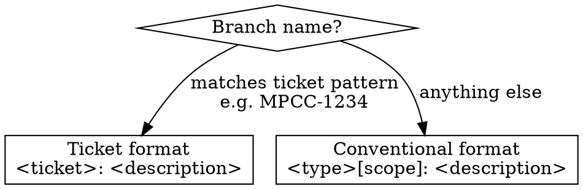

# Creating a Commit

## Format Selection

Check the current branch name to decide which header format to use:



### Ticket Branches

When the branch name matches a ticket pattern (e.g. `MPCC-1234`, `MPMX-42`),
the ticket replaces the type prefix:

```
<ticket>: <description>

[optional body]

Assisted-by: <model name> via <tool name>
```

### Non-Ticket Branches

When the branch does not match a ticket pattern, use Conventional Commits:

```
<type>[optional scope]: <description>

[optional body]

Assisted-by: <model name> via <tool name>
```

**Types:** `feat`, `fix`, `build`, `chore`, `ci`, `docs`, `style`, `refactor`, `perf`, `test`

- `feat` — new feature (correlates with SemVer MINOR)
- `fix` — bug fix (correlates with SemVer PATCH)
- Append `!` after type/scope for breaking changes (correlates with SemVer MAJOR)
- A scope MAY be provided in parentheses: `fix(parser): handle empty input`

## Header Rules

These apply to **both** formats:

- Maximum length: **72 characters**
- **Imperative mood** ("add feature" not "added feature")
- Do NOT end with a period
- Do NOT capitalise the first letter of the description

## Casing

The **entire** commit message MUST be lowercase. Exceptions:

- Proper nouns with inherent casing (e.g. `NixOS`, `GitHub`, `OpenCode`)
- The `Assisted-by` trailer key (standard git trailer convention)
- Model and tool names in the `Assisted-by` value (e.g. `Claude Opus 4`)

## Body

Optional. Describe the **why**, not the what. May use prose or bullet points.
Must be separated from the header by a blank line.

## AI Attribution (`Assisted-by` Trailer)

**Mandatory** on every commit an AI agent creates, including trivial ones.

Per [Xe Iaso's convention](https://xeiaso.net/notes/2025/assisted-by-footer/)
and [Fedora's AI-Assisted Contributions Policy](https://docs.fedoraproject.org/en-US/council/policy/ai-contribution-policy/).

### Rules

1. Use the **actual model name** you are running as — do NOT fabricate.
2. Use **OpenCode** as the tool name (all agents in this repo run inside OpenCode).
3. Multiple models = multiple `Assisted-by` lines.
4. Must be the **last line(s)** of the commit message.

## Examples

### Ticket branch

```
MPCC-34: add opencode global agent rules

add programs.opencode.rules with conventional commit enforcement,
lowercase policy, and assisted-by trailer requirement so all ai
agents produce consistent, machine-readable commit messages.

Assisted-by: Claude Opus 4 via OpenCode
```

### Non-ticket branch (feature)

```
feat(opencode): add skill for commit message formatting

Assisted-by: Claude Sonnet 4 via OpenCode
```

### Non-ticket branch (fix)

```
fix: resolve grafana service breakage after upgrade

the grafana module changed its systemd unit name in the latest
nixpkgs update, breaking the existing service override.

Assisted-by: GPT-4o via OpenCode
```

### Non-ticket branch (chore, no body)

```
chore: update flake lock

Assisted-by: Claude Opus 4 via OpenCode
```
