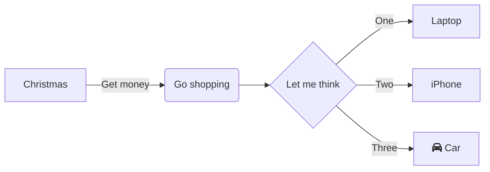

+++
title = "Demo Presentation"
outputs = ["Reveal"]

[params.reveal_hugo]
custom_theme = "stylesheets/nib-theme.scss"
custom_theme_compile = true
+++

# Title Slide Heading

---

## First Slide Heading

Yep here we go

Hello docker


---

## This is another slide

Now we are going to test inlien code blocks `another`

And a second line goes here

lets start hugo

```bash
hugo server --port 1314 --bind 127.0.0.1
```
---

## Code test slide

```json
{
    "this": "is",
    "a": true,
    "json": 1
}
```

---

## Mermaid test slide



---

## Mermaid with custom CSS


---


## Side by side 



{}
Say thank you
{}

This should be in the first column:

- First point
- second point

----  <!-- Separator between columns -->

This should be in the second column:

```json
{
    "this": "is",
    "a": true,
    "json": 1
}
```

{}
And thank the audience
{}


